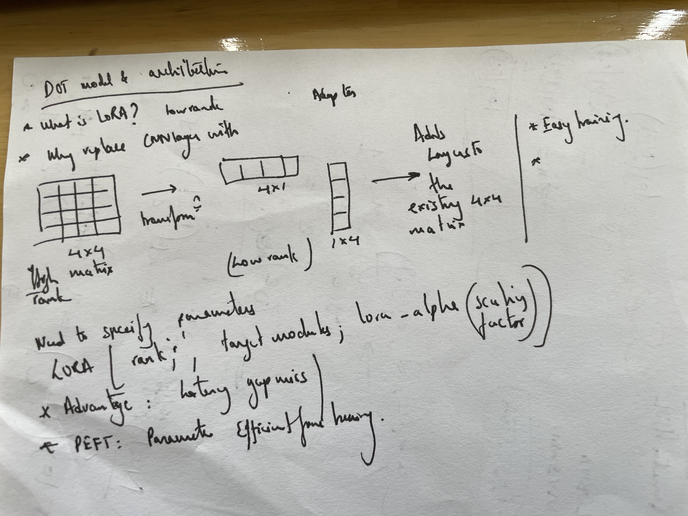
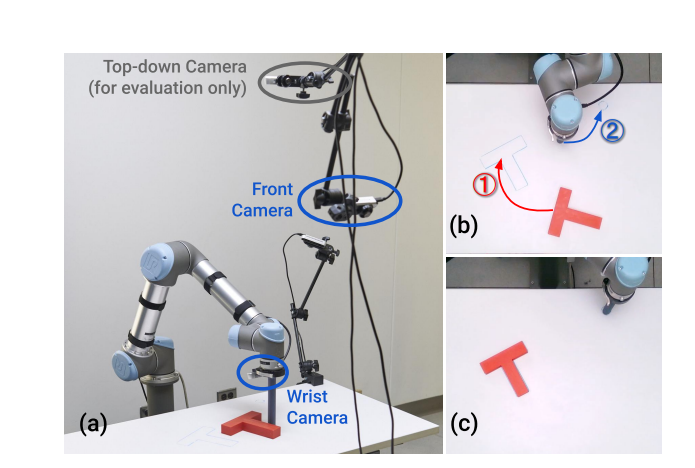

Original RESNET meant to handle images only. 

The updated moduleDict is meant to handle images and some other multi modal form:
1. (ModuleDict):
It's wrapped in a ModuleDict container with two keys:
"images": Contains a ResNet model (same architecture as the second model)
"state": Contains a separate Linear layer (in_features=2, out_features=128)
This suggests it's designed to process two different types of inputs (images and some state information) and combine them
- The ResNet part processes images and outputs 128-dimensional features (through its fc layer)
- The state part processes some 2-dimensional input into 128-dimensional features

2. (Plain ResNet):
It's a standalone ResNet model without any ModuleDict wrapper
It only processes image inputs (no separate state processing)
The architecture is otherwise identical to the ResNet inside the ModuleDict
Same output dimension (128) through its fc layer


- Model 1 (ModuleDict) is more complex, designed for multi-input processing (images + state).
- Model 2 (Plain ResNet) is a standard image-only model with the same ResNet backbone.

Both share identical ResNet architecture, LoRA layers, and frozen batch norm.

D.o.T--> Decorder only Transformer 

Why used?






3 Cameras are used here. Multiple camera provide richer information on the task scene, allow even if one view is blocked

1. Wrist camera:
2. Front camera:
3. Top down camera (for evaluation only)
## As per the paper Diffusion Policy: Visuomotor Policy Learning via Action Diffusion:

Top-down camera – Marked as “evaluation only” in Fig. V. This camera is not used as an observation input to the policy. Instead, it’s used offline for:
Measuring success metrics — e.g., computing the IoU between the final T-block position and the goal region.
Qualitative evaluation and video recording — producing the visualizations shown in the paper and supplemental videos.


The visual encoder processes each camera view separately and concatenates their embeddings before feeding them into the diffusion policy.
The dataset generated was through human operator manually.
The Push-T datasets were created from human demonstrations on a tabletop pushing task in two settings:
- Real-world dataset – Collected by having a human teleoperate a robot to push a puck toward a goal using an overhead camera and visual feedback.
- Simulation dataset – Generated in a simulated environment that closely matches the real-world setup, again with human teleoperation to produce expert demonstrations.

Few basics recap: 
- Base model is the RESNET10 model. 
- Replace

There are 2 train.py files. 
1. dot2/lerobot/lerobot/configs/train.py (Configuration File) 
Defines the training pipeline config structure
Handles config 

2. dot2/lerobot/lerobot/scripts/train.py (Training Script)
 Actual training execution script that implements the training loop:

### Dataset loading: 
Parquet for the data files are loaded. This includes the action and obs information. After this video files are also chopped as per the timestamps and further loaded as well.

These parquet files contain:
- Actions: Robot control commands
- Observations: Robot state, sensor readings
- Rewards: Task completion signals
- Timestamps: Precise timing information
- Task indices: Which task is being performed
- Episode indices: Which episode each frame belongs to

The video files are loaded on-demand when you access specific data points, and they're precisely chopped according to timestamps:

Stepwise: 
- Calculate current timestamps
- Calculate query timestamps for vide frames based on current_ts, query_indices
- Decode specific frames at that timestamp and sync ensuring that it valid.
- used a standard torch.util.dataloader class
- all modalities are accessed using the __getitem__ class [image, action, obs]


Information fed into subsequent streams: 
{
    # From parquet files
    "action": torch.tensor(...),
    "observation": torch.tensor(...),
    "reward": torch.tensor(...),
    "timestamp": torch.tensor(...),
    "episode_index": torch.tensor(...),
    "task_index": torch.tensor(...),
    
    # From video files (if applicable)
    "observation.images.camera1": torch.tensor(...),  # Video frames
    "observation.images.camera2": torch.tensor(...),
    
    # Additional metadata
    "task": "pick up the red block",
    "dataset_index": torch.tensor(0),  # If using MultiLeRobotDataset
    
    # Temporal offsets (if using delta_timestamps)
    "action_t+1": torch.tensor(...),
    "action_t+2": torch.tensor(...),
    "action_t+1_is_pad": torch.tensor(False),
    "action_t+2_is_pad": torch.tensor(False)
}

Dataset used: lerobot/pusht

Dataset sample which is output from the dataset.loaders can be visualized using command: 
```
from lerobot.common.datasets.lerobot_dataset import LeRobotDataset
dataset = LeRobotDataset(repo_id="lerobot/pusht")    
print(dataset[0])
```

dataset.features
{'observation.image': {'dtype': 'video', 'shape': (...), 'names': [...], 'video_info': {...}}, 'observation.state': {'dtype': 'float32', 'shape': (...), 'names': {...}}, 'action': {'dtype': 'float32', 'shape': (...), 'names': {...}}, 'episode_index': {'dtype': 'int64', 'shape': (...), 'names': None}, 'frame_index': {'dtype': 'int64', 'shape': (...), 'names': None}, 'timestamp': {'dtype': 'float32', 'shape': (...), 'names': None}, 'next.reward': {'dtype': 'float32', 'shape': (...), 'names': None}, 'next.done': {'dtype': 'bool', 'shape': (...), 'names': None}, 'next.success': {'dtype': 'bool', 'shape': (...), 'names': None}, 'index': {'dtype': 'int64', 'shape': (...), 'names': None}, 'task_index': {'dtype': 'int64', 'shape': (...), 'names': None}}

### here is the normalization profile: 
    normalization_mapping: dict[str, NormalizationMode] = field(
        default_factory=lambda: {
            "VISUAL": NormalizationMode.MEAN_STD,
            "STATE": NormalizationMode.MIN_MAX,
            "ENV": NormalizationMode.MIN_MAX,
            "ACTION": NormalizationMode.MIN_MAX,
        }
    )
the outlier compresses the min-max normalized values toward the lower end, while standardization spreads them based on their distance from the mean.
Change image to MIN_MAX as it keeps the [0, 255] values to [0, 1]


#### Ilia Readme.md


## Walkthrough

```
.
├── examples             # contains demonstration examples, start here to learn about LeRobot
|   └── advanced         # contains even more examples for those who have mastered the basics
├── lerobot
|   ├── configs          # contains config classes with all options that you can override in the command line
|   ├── common           # contains classes and utilities
|   |   ├── datasets       # various datasets of human demonstrations: aloha, pusht, xarm
|   |   ├── envs           # various sim environments: aloha, pusht, xarm
|   |   ├── policies       # various policies: act, diffusion, tdmpc
|   |   ├── robot_devices  # various real devices: dynamixel motors, opencv cameras, koch robots
|   |   └── utils          # various utilities
|   └── scripts          # contains functions to execute via command line
|       ├── eval.py                 # load policy and evaluate it on an environment
|       ├── train.py                # train a policy via imitation learning and/or reinforcement learning
|       ├── control_robot.py        # teleoperate a real robot, record data, run a policy
|       ├── push_dataset_to_hub.py  # convert your dataset into LeRobot dataset format and upload it to the Hugging Face hub
|       └── visualize_dataset.py    # load a dataset and render its demonstrations
├── outputs               # contains results of scripts execution: logs, videos, model checkpoints
└── tests                 # contains pytest utilities for continuous integration
```

### The `LeRobotDataset` format

A dataset in `LeRobotDataset` format is very simple to use. It can be loaded from a repository on the Hugging Face hub or a local folder simply with e.g. `dataset = LeRobotDataset("lerobot/aloha_static_coffee")` and can be indexed into like any Hugging Face and PyTorch dataset. For instance `dataset[0]` will retrieve a single temporal frame from the dataset containing observation(s) and an action as PyTorch tensors ready to be fed to a model.

A specificity of `LeRobotDataset` is that, rather than retrieving a single frame by its index, we can retrieve several frames based on their temporal relationship with the indexed frame, by setting `delta_timestamps` to a list of relative times with respect to the indexed frame. For example, with `delta_timestamps = {"observation.image": [-1, -0.5, -0.2, 0]}`  one can retrieve, for a given index, 4 frames: 3 "previous" frames 1 second, 0.5 seconds, and 0.2 seconds before the indexed frame, and the indexed frame itself (corresponding to the 0 entry). See example [1_load_lerobot_dataset.py](examples/1_load_lerobot_dataset.py) for more details on `delta_timestamps`.

Under the hood, the `LeRobotDataset` format makes use of several ways to serialize data which can be useful to understand if you plan to work more closely with this format. We tried to make a flexible yet simple dataset format that would cover most type of features and specificities present in reinforcement learning and robotics, in simulation and in real-world, with a focus on cameras and robot states but easily extended to other types of sensory inputs as long as they can be represented by a tensor.

Here are the important details and internal structure organization of a typical `LeRobotDataset` instantiated with `dataset = LeRobotDataset("lerobot/aloha_static_coffee")`. The exact features will change from dataset to dataset but not the main aspects:

```
dataset attributes:
  ├ hf_dataset: a Hugging Face dataset (backed by Arrow/parquet). Typical features example:
  │  ├ observation.images.cam_high (VideoFrame):
  │  │   VideoFrame = {'path': path to a mp4 video, 'timestamp' (float32): timestamp in the video}
  │  ├ observation.state (list of float32): position of an arm joints (for instance)
  │  ... (more observations)
  │  ├ action (list of float32): goal position of an arm joints (for instance)
  │  ├ episode_index (int64): index of the episode for this sample
  │  ├ frame_index (int64): index of the frame for this sample in the episode ; starts at 0 for each episode
  │  ├ timestamp (float32): timestamp in the episode
  │  ├ next.done (bool): indicates the end of en episode ; True for the last frame in each episode
  │  └ index (int64): general index in the whole dataset
  ├ episode_data_index: contains 2 tensors with the start and end indices of each episode
  │  ├ from (1D int64 tensor): first frame index for each episode — shape (num episodes,) starts with 0
  │  └ to: (1D int64 tensor): last frame index for each episode — shape (num episodes,)
  ├ stats: a dictionary of statistics (max, mean, min, std) for each feature in the dataset, for instance
  │  ├ observation.images.cam_high: {'max': tensor with same number of dimensions (e.g. `(c, 1, 1)` for images, `(c,)` for states), etc.}
  │  ...
  ├ info: a dictionary of metadata on the dataset
  │  ├ codebase_version (str): this is to keep track of the codebase version the dataset was created with
  │  ├ fps (float): frame per second the dataset is recorded/synchronized to
  │  ├ video (bool): indicates if frames are encoded in mp4 video files to save space or stored as png files
  │  └ encoding (dict): if video, this documents the main options that were used with ffmpeg to encode the videos
  ├ videos_dir (Path): where the mp4 videos or png images are stored/accessed
  └ camera_keys (list of string): the keys to access camera features in the item returned by the dataset (e.g. `["observation.images.cam_high", ...]`)
```

A `LeRobotDataset` is serialised using several widespread file formats for each of its parts, namely:
- hf_dataset stored using Hugging Face datasets library serialization to parquet
- videos are stored in mp4 format to save space
- metadata are stored in plain json/jsonl files

Dataset can be uploaded/downloaded from the HuggingFace hub seamlessly. To work on a local dataset, you can use the `local_files_only` argument and specify its location with the `root` argument if it's not in the default `~/.cache/huggingface/lerobot` location.

### Evaluate a pretrained policy

Check out [example 2](./examples/2_evaluate_pretrained_policy.py) that illustrates how to download a pretrained policy from Hugging Face hub, and run an evaluation on its corresponding environment.

We also provide a more capable script to parallelize the evaluation over multiple environments during the same rollout. Here is an example with a pretrained model hosted on [lerobot/diffusion_pusht](https://huggingface.co/lerobot/diffusion_pusht):
```bash
python lerobot/scripts/eval.py \
    --policy.path=lerobot/diffusion_pusht \
    --env.type=pusht \
    --eval.batch_size=10 \
    --eval.n_episodes=10 \
    --use_amp=false \
    --device=cuda
```

Note: After training your own policy, you can re-evaluate the checkpoints with:

```bash
python lerobot/scripts/eval.py --policy.path={OUTPUT_DIR}/checkpoints/last/pretrained_model
```

See `python lerobot/scripts/eval.py --help` for more instructions.


```
False Positives: 

File name: /home/skr3178/DOT_policy/dot2/lerobot/outputs/eval/2025-08-08/20-56-08_pusht_dot/eval_info.json

      "episode_ix": 3,
      "sum_reward": 218.33199651004662,
      "max_reward": 0.9981795840920044,
      "success": false,
      "seed": 1000003


Video reference: /home/skr3178/DOT_policy/dot2/lerobot/outputs/eval/2025-08-08/20-56-08_pusht_dot/videos/eval_episode_3.mp4
