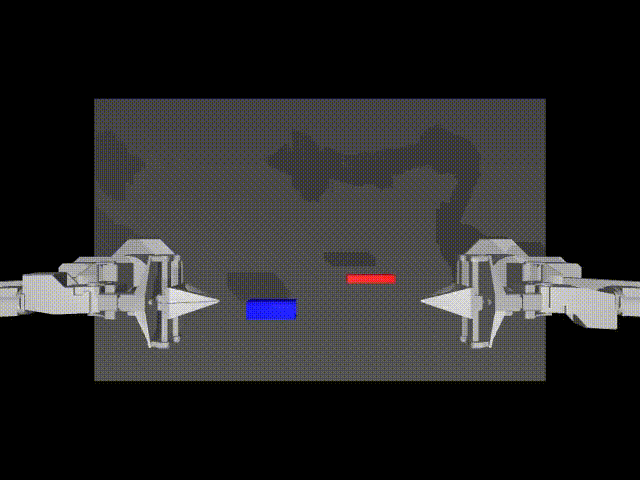

# Decoder Only Transformer Policy - simple but powerful model for behavioral cloning

[](https://doi.org/10.5281/zenodo.14789259)

## Table of Contents
- [Summary](#summary)
- [How to use the model](#how-to-use-the-model)
  - [Reproduce and validate the results](#reproduce-and-validate-the-results)
- [Problem introduction](#problem-introduction)
  - [PushT](#pusht)
  - [ALOHA insertion](#aloha-insertion)
- [The rational and high level thoughts](#the-rational-and-high-level-thoughts)
- [Policy](#policy)
  - [Model architecture](#model-architecture)
  - [Model configuration](#model-configuration)
  - [Training process](#training-process)
- [Results](#results)
  - [Evaluation approach](#evaluation-approach)
  - [PushT Environment](#pusht-environment)
  - [ALOHA Environment](#aloha-environment)
  - [Fails analysis](#fails-analysis)
  - [SO-ARM100 Robot demonstration](#so-arm100-robot-qualitative-demonstration)
- [Future ideas](#future-ideas)
- [Conclusion](#conclusion)

## Summary

This is a technical report about my experiments with Behavior Cloning models for robotics, using LeRobot library.

I present a DOT-policy - simple and small BC model that beats the SOTA models like ACT, Diffusion policy, VQ-BET in two simulated environments: PushT, and Bimanual Insert in ALOHA.
- The model is non-generative: doesn't use any generative components like VAE, GAN, Diffusion, Flow matching etc.
- The model doesn't use discretization or tokenization of action space, it directly deal with continuous actions.
- The size of the model is relatively small: 14M parameters (2M without visual backbone), only around 2-3M parameters are trainable, comparing to 33-270M+ in the SOTA models trained for the same problems.
- The model is trained in one stage, without any additional training steps like VQ-BET or Diffusion.
- Minimized number of custom components e.g. use standard Pytorch transformers implementation.
- Mentioned result are achieved by pure behavior cloning approach by training only on the original human demonstrations dataset. The results are mainly achieved by improving the training process, optimization of the model configuration and a some tricks for inference optimization.

I did most of my analysis based on simple simulation environments PushT and ALOHA, that don't fully represent the complexity of the real world robots, so some of the ideas can work worse in the real life. Nevertheless, I did some simple qualitative tests using SO-ARM100 robot and the policy can successfully perform very simple tasks (more serious real robots experiments TBD).

Currently the validation is limited to just 2 simple simulated environments and I observe that all the models have very noisy results that are very sensitive to parameters, checkpoint selection and even random seed used. I don't claim that DOT policy is a new SOTA for the BC overall, but I hope that the ideas that I proposed can be integrates in other models and can improve their performance.

It is not a formal paper but rather experiments results and thoughts sharing so, please read with some skepticism and forgive me some less formal language and structure.

## How to use the model

The policy is implemented using LeRobot library and it is required to run the code from this repository. For simplicity you can use this branch https://github.com/IliaLarchenko/lerobot/tree/dot_new_config to reproduce results presented on this page or try DOT-Policy for you problems.

LeRobot has recently released a big change in the usage of config files without backward compatibility. I conducted most of my experiments before this change (using [this branch](https://github.com/IliaLarchenko/lerobot/tree/dot)). All yaml files and original code in this repository were used in the old version of the library. But the latest version of the code and all commands in this document are adapted for the new version of the library.

To start install the library from the branch following the original instructions.

### Reproduce and validate the results
I provide the pretrained models for all 3 problems on the Hugging Face hub.

https://huggingface.co/IliaLarchenko/dot_pusht_keypoints

https://huggingface.co/IliaLarchenko/dot_pusht_images

https://huggingface.co/IliaLarchenko/dot_bimanual_insert


To train any model use:

```bash
python lerobot/scripts/train.py ...
```

To evaluate the model use:

```bash
python lerobot/scripts/eval.py ...
```

The whole train and eval commands with used parameters are provided in the model cards on the Hugging Face hub.


## Problem introduction

I am testing my model in PushT and ALOHA environments and compare them with the ACT, Diffusion, and VQ-BET policies. Below are links to the original papers and repositories.

- LeRobot library: https://github.com/huggingface/lerobot
- PushT environment: https://github.com/huggingface/gym-pusht
- ALOHA environment: https://github.com/huggingface/gym-aloha
- ACT paper: [Learning Fine-Grained Bimanual Manipulation with Low-Cost Hardware](https://arxiv.org/pdf/2304.13705.pdf)
- Diffusion paper: [Diffusion Policy: Visuomotor PolicyLearning via Action Diffusion](https://arxiv.org/pdf/2303.04137.pdf)
- VQ-BET paper: [Behavior Generation with Latent Actions](https://arxiv.org/pdf/2403.03181.pdf)

These are great resources and I recommend to read papers and go through repositories first as I will refer to them in my analysis. I you are reading this I guess you are interested in robotics and you definitely should learn more about these models.


### PushT
PushT is a simple environment but it requires dealing with multimodality (at least short term one) to achieve good results.
[](https://youtube.com/watch?v=NlUh5KH1-uU)

### ALOHA insertion
ALOHA bimanual insertion is more straightforward. It probably has less of the multimodality problem but requires very precise actions to complete the task.

[](https://www.youtube.com/watch?v=n6ZjEDXGBk4)

Even so both tasks are relatively simple they reflect 2 common real world problem for behavior cloning, and I believe that the results on these environments can be to some extent extrapolated to more complex problems and real robots.

## The rational and high level thoughts

I recently decided to learn more about imitation learning and behavior cloning in robotics. While reading the main papers in the field I had a feeling that many models are a bit overengineered and overcomplicated and there are a lot of focus on the architecture and the potential optimization from the training process can be missing.

In particular I noticed and wanted to validate the following ideas (my raw thoughts after reading the papers):

- In robotics we deal with very low dimensional data compared to images or text (except for the image inputs of course). In the PushT Dataset, the state or action of the robot is just 2 numbers - x,y coordinates. For a robot arm, it is generally the number of joints (e.g. 6 for SO-ARM100). Even a bimanual mobile robot (e.g. ALOHA) will have 10-20 numbers as a state/action. This is way lower than in text - where each token is represented by 512+ dimensional embeddings and the number of tokens is generally much higher than the robot prediction horizon. It's also lower than images where each pixel is 3 numbers, so even a 640x480 image is ~1M numbers. This means that relatively small and simple models should be enough for some robotics tasks.

- It also means that common sets of hyperparameters and ways how models are used in the text/image field may not be optimal for robotics tasks and we can adjust them. For example, transformers are SOTA in most sequential prediction problems now, and it is reasonable to use them to predict sequences of actions. But their usage can differ from other tasks. In text, both inputs and outputs are text tokens - each token has meaning and can't be skipped, requiring token-by-token prediction. In robotics problems, inputs are state variables and past actions, while prediction is a sequence of actions.
  - Inputs come from different modalities and should be treated accordingly.
  - Outputs are not independent tokens but rather a highly correlated sequence of actions. For example, if we remove one action we can often interpolate it back from neighboring actions. This is not possible with text tokens.

- Some of the SOTA models use simple augmentations (e.g. Diffusion and VQ-BET use crop augmentation) but it is not emphasized much in the papers, while I think it gives a significant boost to results. In behavioral cloning, the task is often to learn some complex actions in real-world environments relying mostly on image data that is collected from robot cameras that can be noisy and shaky. This is exactly where image augmentations shine, and I would expect them to be used everywhere. But for some reason they are not.

- Some models solve multimodality by using VAE (ACT) or Diffusion process. That also seems a bit overcomplicated. During inference we don't need all the possible modalities, we just need one to be selected - as opposed to text/image generation where we need to generate a new unique "image of cat" every time when the model is asked to do so. So this generative part is needed mostly for the training process to force the model to learn the multimodal distribution. But we can achieve it by much simpler means.

- VQ-BET uses a different approach by clustering all possible actions and then predicting the cluster index (with some additional tweaks). There are other papers that are focused on action space tokenization. This looks a bit overcomplicated as we switch from the continuous action space to the discrete one and then back to the continuous one. In the LLM field, tokenization is considered one of the weakest points but it is hard to avoid. In robotics, the action space is already continuous and extra tokenization can be even harmful (even though it makes a lot of sense in the context of multimodality).

I started experimenting with policy design to better understand existing approaches, gain intuition about their necessity, and validate the ideas mentioned above. My goal was to implement the simplest reasonable architecture and evaluate how it compares to SOTA models, while identifying which ideas provide the main performance boost. Ultimately, I was able to achieve results that surpassed all mentioned models on the simulated datasets.

## Policy

### Model architecture
TLDR: I project each input to the same dimension using either a linear layer or ResNet backbone and send them to a transformer decoder along with sinusoidal positional encoding. The transformer decoder predicts actions for the next horizon steps that are then averaged with exponentially decaying weights.

Overall it is most similar to the ACT model but stripped of a lot of components: no VAE, no encoder, no spatial feature extraction for images, simpler positional encoding, and mostly default implementation of the transformer and other components + a few extra features and tricks described below.

The schema of the model architecture:


High level description:
- Model takes as inputs the current and past states and images
- States are projected to hidden dimension using a linear layer
- Images are projected using a visual backbone (ResNet18)
- All these projections are sent as "memory" to the Transformer Decoder along with positional encoding (sinusoidal for actions, trainable embeddings for the rest)
- Transformer decoder predicts the final actions that are mapped to the original action space with a linear layer

Below is a more detailed description of important components and decisions.

### Model configuration

#### Visual backbone

- I used ResNet18 pretrained on ImageNet1K for all my experiments. Potentially it can be beneficial to use other backbones but I haven't experimented with them yet.

- I don't use any visual backbone modifications like spatial softmax (Diffusion, VQ-BET) or transformer encoder (ACT) as they are not necessary and didn't show improvements in my tests. My intuition here is that things like spatial softmax have very low resolution and don't really help to capture useful concepts in the images. For example, you may expect one of the channels of the spatial softmax to capture the position of the block in the image, but given the final 2D layer resolution it will be very imprecise. At the same time, the output of the FC layer of the visual backbone can directly predict that the block is N pixels from the manipulator in some particular direction - this is much more precise and useful information that can be used by the decoder to predict the action.

- I use the same visual backbone for all the images. All images are rescaled to the same resolution, concatenated and projections are computed in one go. It is fast but could be suboptimal in performance. I haven't done quantitative tests in environments with multiple cameras. However, it worked well in my tests with the SO-ARM100 robot where I used 2 cameras with different resolutions, angles and color quality. The rationale is simple: even though cameras can have different angles, they are looking at the same objects and there should be cross-learning between them, at least in the first layers of the visual backbone. In future tests, I plan to experiment with separate FC layers or final layers for each camera.


#### Transformer decoder

Below are the main parameters of the transformer decoder that I used in my experiments. They are configurable in the yaml files but I used the same set of parameters for all the problems.
```
  pre_norm: true
  dim_model: 128
  n_heads: 8
  dim_feedforward: 512
  n_decoder_layers: 8
```

- I use lower dim_model and dim_feedforward compared to e.g. the default params of the ACT model. As I mentioned above, the data is low dimensional and we don't need to capture very complex dependencies. 128 / 8 = 16 dimensions per head should be enough to capture the information. Too big dim_model also doesn't seem necessary - I didn't see any boost in performance but it slows down and increases the complexity of the model. I use dim_feedforward = 4 * dim_model.

- I don't use an encoder in the transformer, mostly for simplicity - I just send the projections of the inputs as memory to the decoder. Though this decision may not be optimal because it won't scale well for longer prediction horizons. An ACT-like encoder-decoder with a very small decoder or different attention logic could be more efficient in this case. Nevertheless, I kept it simple and it worked well for these basic problems. I will test more complex architectures in the future.

### Timestamps used for features and actions

- Similarly to many SOTA models DOT-model uses a series of past observations and predicts a series of future actions. But the way I use them is novel. Below is the scheme or input-output structure of the model:


#### Inputs

- The current observation sometimes doesn't have enough data for robust action predictions, e.g. some previously seen objects can be outside the camera range. Having at least 2 recent observations allows models to estimate velocity in addition to position and can help deal with multimodality and improve overall performance. This is why I use at least 2 last observations as inputs for the model.

- In my tests I found that adding even more observations increases convergence speed and results of lightweight image-free models on the PushT keypoints dataset. However, it works much worse with bigger models and also slows down training and inference. This is why I decided to use a more computationally efficient approach and provide the model with sparser historical data.

- As mentioned earlier, unlike text and other applications, consecutive observations in behavioral cloning are usually highly correlated. If you provide a model with 10 observations from T-9 to T, you don't really provide 10 times more information. Moreover, if you provide just 2 observations from T and T-9, the model will get most of the information it needs since everything between T-8 and T-1 can be easily interpolated.

- So this is what I do: I provide the model with `n_obs_steps - 1` most recent observations so it can get the latest info about positions and velocities, and additionally I provide 1 observation from `lookback_obs_steps` ago to give the model a better long-term view of the problem and current strategy.

- During inference I use the past observations exactly `lookback_obs_steps` steps ago. During training I augment this by randomly selecting the past observation from the range `[lookback_obs_steps - lookback_aug, lookback_obs_steps + lookback_aug]` steps ago. This creates realistic training data through reasonable augmentation.

- In practice I used `n_obs_steps = 3` for all problems - 2 most recent observations and 1 extra observation from `lookback_obs_steps` ago. `lookback_obs_steps` and `lookback_aug` are unique for each problem and depend on the FPS and prediction horizon.


#### Prediction (actions)
- Similarly to most SOTA models, DOT-model predicts series of future actions instead of just 1 next action. It also predicts past actions corresponding to all the observations that are used as inputs.

- The prediction horizon can be different for training and inference and is set by 2 different hyperparameters `train_horizon` and `inference_horizon`, where `train_horizon` >= `inference_horizon`. The idea is during training we want the model to solve more complex tasks and predict longer term series of actions, while during inference we want to use only more reliable first predictions and speed up the inference process.

- We predict the actions together so unlike in Language Models there is no reason to have causal mask in the decoder. But to make sure that the Decoder behavior is consistent during training and inference, I apply a special mask that hides the last `train_horizon - inference_horizon` steps from `inference_horizon` predictions. This means that during training, prediction for the first `inference_horizon` doesn't see the future actions and behaves exactly like during inference, but the extra `train_horizon - inference_horizon` can see the whole picture.

- During inference, corresponding predictions from the last `inference_horizon` steps are averaged (as in ACT policy) with exponentially decaying weights. I use quite aggressive weights decay factor `alpha` which means that the far predictions are almost completely ignored. This means that if you set `inference_horizon = train_horizon` the results will be almost the same anyway - the main reason to use different horizons is to speed up the inference process.

- I also apply exponentially decaying weights when I compute the loss during training. If we rely much less on the far predictions during inference, it makes sense to rely less on them during training too. It is a simple way to make the training process more consistent with the inference process. But the weights decay factor `training_alpha` is much less aggressive than during inference because we still want to learn from the far predictions.

- I also make predictions for the actions corresponding to the past observations provided to the model. It is a simple way to give the model a bit of strategic view and information about the past actions (and also it should be much easier to predict the past actions as the model already knows the current state and can guess what actions were taken in the past). Alternatively we can use past actions as features but it is more complicated during inference time and I found that predicting them directly works better in my tests. The same approach is used in the Diffusion and VQ-BET models.


#### Inference optimization

I provide 2 additional parameters to optimize the inference process: `predict_every_n` and `return_every_n`:

- `predict_every_n` specifies how often the model should make predictions. For example, if `predict_every_n = 5`, the model will make predictions only every 5th step and for all other steps it will just use the latest available prediction shifted by the number of steps that passed since the last prediction. This is a very efficient way to speed up inference without losing much performance. The same approach is used in Diffusion policy. However, in practice the DOT model is very small and fast, so this optimization is only needed when running on real robots with weak hardware.

- `return_every_n` is similar but different - it doesn't speed up inference but speeds up robot actions. For example, if `return_every_n = 5`, instead of returning the next predicted action, the policy will return the action 5 steps ahead - it behaves the same as `predict_every_n` but only last prediction of every group of `return_every_n` is eventually returned. This parameter can be useful in cases where task completion time is more important than precision. In my experiments with PushT keypoints dataset I found that if I extended the time limit from 30s (original limit) to 60s, the success rate of the model can go up from ~80% up to 95%. This means the policy only truly failed in 5% of cases - in the other 15% it just ran out of time. Increasing `return_every_n` to 2 allowed me to achieve extra few % of success rate for both PushT problems (trading some long-term precision to speed up task completion time). Note that this works only for problems where the model predictions are already very good (e.g. in PushT case I have seen boost only for models with >65% success rate)

- I implemented the policy in a way that both of this parameters can be overwritten during the inference process. During the training just keep them equal to 1.

- For the future I am wondering if it is possible to adjust `return_every_n` dynamically, e.g. somehow evaluate the confidence of each model prediction and increase `return_every_n` when the model is confident to move faster and decrease it when the model is not sure and high precision is needed. This can be an interesting research direction, but I haven't tested it yet.


### Training process

- The model is trained using the behavioral cloning approach - I simply try to predict the actions that happened in the real demonstrations. No RL or other techniques are used.

- The loss is calculated as a weighted mean of L1 losses for all predicted actions. The weighting strategy is described above. In my experiments, L2 loss behaves worse than L1 loss (aligning with results from the ACT paper).

- I use AdamW optimizer and CosineLR scheduler. But in the final versions of some models I used the same min and max LR, so it is basically flat.

#### Backbone overfitting prevention using LoRA

- I found that models without images for PushT keypoints basically don't overfit - they can get close to the best results after ~100 epochs and stay relatively stable in that area. When trained 10 times longer the results slightly improve, but training even longer doesn't improve results more nor leads to overfitting - the validation metrics don't go down even after !M epochs.

- It's different for all image-based models - they also achieve good results very fast but then start overfitting - while train loss goes down, the validation metrics become worse. My guess is this happens because the image-based models have too many parameters, with 2/3 of them in the backbone that's supposed to extract simple features and only 1/3 in the transformer that's supposed to do the decision making.

- Based on this observation, to stabilize the training process I wanted to slow down and regularize backbone training. At the same time, I wanted to use a pretrained backbone since it's supposed to be very good at extracting low-level features. I saw 3 ways to do this:
  - Use lower learning rate for backbone (like in ACT)
  - Only partially unfreeze the backbone (freeze first layers and train only the last ones)
  - Use LoRA (https://arxiv.org/abs/2106.09685) to limit trainable parameters and significantly regularize backbone training (keeping weights close to original pretrained weights unless necessary to change them)

- The low learning rate approach didn't work well - the initial convergence slowed down while it still overfitted in the long run.

- I briefly tried partial unfreezing and combining it with low learning rate: training the last couple layers with high lr and the rest with very low lr. It worked better but didn't completely solve the overfitting. While it might be possible to make this work, I eventually moved to the third approach which actually solved the problem.

- Note that in this case the benefits of LoRA are slightly different from its typical use in very large models, especially for images or text. ResNet18 is already extremely small, and training iterations are actually a bit slower with LoRA in this case. But it perfectly addresses the problem of backbone overfitting in small models.

- During inference we merge the LoRA weights back into the original backbone weights so the model looks exactly like it did without LoRA and inference speed is the same. To do this, just set the `merge_lora` attribute of the saved model to `true` and the merging will happen automatically after weights are loaded.

- I use LoRA rank = 20 for all modes. It drastically reduced the number of trainable parameters in the backbone from ~11M to 0.7M - more than 10 times. I did some experiments with other ranks and everything in range 10-40 works relatively well. I didn't optimize it further.

- I found that different problems require very different training times and LR. PushT keypoints can be trained for 1M+ steps and benefits from it, PushT with images also benefits from 1M+ training if we use LoRA, while Insert problem gives close to optimal results even after ~50-100k steps and starts overfitting if trained for too long, LoRA training helps to reduce this overfiting a lot but doesn't completely solve the problem. Unfortunately, I haven't found a universal formula for defining the optimal training time - this is one of the future steps I want to look at. I just train Insert model for 100k steps with lower LR than PushT.


#### Augmentation

I have an intuition that augmentations should be an essential part of the training process for robotics models but it seems to be overlooked in many papers:
- We usually deal with limited data. Creating more data by augmenting the existing data should be very beneficial.
- The data is very noisy. Yes, some expensive commercial robots are very precise and use extremely accurate cameras and sensors with very low noise. But in many cases this is not true. The data from cameras and sensors is prone to noise, shaking, occlusions, lighting changes, etc. We want models to be more universal and robust in different environments and augmentations can help with that.
- Robotics systems often work with image data and there are already many augmentations that are proven to be useful for other tasks. So we can leverage these existing techniques.

In this particular analysis I used three simple augmentations:
1. Random crop to 80-100% of the original image size (`crop_scale`)
2. Random uniform noise of up to +/-0.01 added for all states (`state_noise`)
3. Random selection of the past observation from the range `[lookback_obs_steps - lookback_aug, lookback_obs_steps + lookback_aug]` steps ago (described above)

The aggressiveness of the first 2 augmentations is high at the beginning of the training process and then exponentially decays every step - set by the `noise_decay` parameter.

I believe that more augmentations can be used to improve the model performance even further. I will work on this in future iterations of my analysis. This should be especially important for real-world problems rather than the simulated ones that are the focus of this analysis.

Note: The current implementation of augmentations is not perfect - they should ideally be implemented in the dataloader. However, I wanted to keep the model code as simple as possible for now and was also restricted by the current implementation of the LeRobot library. I will work on a better implementation that can be applied across different models in future iterations.


## Results

### Quick Results Overview

| Task | DOT Success Rate | DOT Params | Previous SOTA Success Rate | SOTA Params |
|------|-----------------|------------|---------------------------|-------------|
| PushT Keypoints | 84.5% | 2M | 74.6% (Diffusion) | 249M |
| PushT Images | 74.2% | 14M | 68.9% (Diffusion) | 263M |
| ALOHA Insert | 29.6% | 14M | 21.3% (ACT) | 52M |

The DOT policy achieves better success rates across all tested environments while using significantly fewer parameters than previous state-of-the-art models. Detailed results and analysis are provided in the following sections.

### Evaluation approach

I found that evaluation results on all of these datasets are very noisy. Just selecting checkpoints a few epochs before or after can give you an +/-5% score for most models (sometimes even +/-10%). Retraining the same model with the same set of parameters can also lead to similar differences. For example, when I reproduced models available on https://huggingface.co/lerobot using their provided code, I got slightly different results in each case.

Below I compare results of the DOT policy versus results I achieved by training 3 other policies: ACT, Diffusion and VQ-BET. When available, I also provide numbers from the original papers and evaluations of models trained by the LeRobot team (available at https://huggingface.co/lerobot). However, I don't use these as direct references since they may not be directly comparable to my results (due to slightly different simulated environments and parameters). Instead, I use them as reference points for the level of variance in the results.

For all non-DOT models, I either used default parameters or did some simple tuning to get better results (e.g., much longer training for ACT on PushT drastically improved its performance).

I tested each model on 1000 random samples (the same set for each model) using the `eval.py` script. I report both success rate and average max score for each problem. While success rate is more important in practice, average max score is usually more stable metric. I also provide the model size in millions of parameters for each model as reference.

### Pusht Environment

#### PushT Keypoints

Comparable results:

| Model | % success (95% coverage) | Avg max reward | Model size (mln params) |
|-------|-------------------------|------------------|------------------|
| **DOT** | **84.5%** | **0.964** | **2** |
| ACT | 67.7% | 0.924 | 40 |
| Diffusion | 65.1% | 0.957| 249 |
| VQ-BET | 68.9% | 0.901 | 26 |

Extra benchmarks:

| Model | % success (95% coverage) | Avg max reward | Model size (mln params) |
|-------|-------------------------|------------------|------------------|
| Diffusion (LeRobot) | 74.6% | 0.947 | 249 |
| Diffusion (paper) | -- | 0.95 | -- |
| Diffusion (VQ-BET paper) | 74% | 0.905 | -- |
| VQ-BET (paper) | 78% | 0.842 | -- |

\* I used `diffusion.num_inference_steps=100` for diffusion model that results in the best quality but in practice can be slow. The original diffusion paper recommends to use `diffusion.num_inference_steps=10` for inference, but it reduces success rate by ~1-3%. It is also applicable to the image model below.

** My reproduced results are significantly lower than extra benchmarks. I used the last checkpoint from the training for all model, but if I use the best checkpoint for each model it moves close to the original results. Checkpoints are pretty noisy, when I retrain these models with slightly different parameters or random seed the results jump up and down a few percent. So, probably there is a way to stabilize the training process and achieve better results for the Diffusion and VQ-BET models.


#### PushT Images
Comparable results:

| Model | % success (95% coverage) | Avg max reward | Model size (mln params) |
|-------|-------------------------|------------------|------------------|
| **DOT** | **74.2%** | 0.936 | **14** |
| ACT | 33.4% | 0.6970 | 52 |
| Diffusion | 68.9% | **0.951** | 263 |
| VQ-BET| 59.6% | 0.8762 | 38 |

Extra benchmarks:

| Model | % success (95% coverage) | Avg max reward | Model size (mln params) |
|-------|-------------------------|------------------|------------------|
| VQ-BET (LeRobot) | 64.8% | 0.876 | 38 |
| VQ-BET (paper) | 68% | 0.768 | -- |
| Diffusion (LeRobot) | 62.8% | 0.949 | 263 |
| Diffusion (paper) | -- | 0.91 | -- |
| Diffusion (VQ-BET paper) | 66% | 0.863 | -- |


\* The ACT model seems to be very unstable on the PushT dataset - the success rate jumps by +/-10% between checkpoints during training. With cherry picking, I could find checkpoints with ~45% success rate, but for fairness I just keep the last checkpoint results for each model in the table. I believe that with careful tuning and optimization the ACT model could achieve 50-60%+ success rate, but I haven't found any public results confirming this and I haven't managed to achieve it myself with a reasonable amount of effort.

### Aloha Environment

#### Insert

| Model | % success | Avg max reward | Model size (mln params) |
|-------|-------------------------|------------------|------------------|
| **DOT** | **29.6%** | **2.69** | **14** |
| ACT | 21.3% | 2.53 | 52 |
| VQ-BET | 6.20% | 1.71 | 43 |

Extra benchmarks:

| Model | % success | Avg max reward | Model size (mln params) |
|-------|-------------------------|------------------|------------------|
| ACT (paper)| 20.0% | -- | 80 |

\* I didn't manage to get any reasonable results from Diffusion Policy (the best performance was ~2% with avg max reward ~0). While this model performs similar tasks successfully in the original paper, it's likely a matter of optimization. Since I couldn't get reasonable results and didn't find any public model results on this dataset, I've excluded it from the comparison here. I can add it later when I manage to get better results.

### Fails analysis

I did a very high-level analysis of the fails of the DOT model on the PushT and Insert problems. I looked at a few random fails and tried to categorize them. Below are the main findings.

#### PushT

Below you can see a couple of random examples where the DOT model failed on the PushT Dataset. In these videos, I gave the policy more time (100 seconds instead of 30) to show "real fails" where the model gets stuck indefinitely.

[](https://youtube.com/watch?v=EnXVOjfCWwA)

~70% of fails (after high level manual inspection) of the keypoints model are similar to the first video where the policy performs well but gets stuck close to the end:
- Sometimes the distance to success is just too small (e.g. 94% coverage vs. 95% required) so the model believes it has finished and stops. This is even more common in the image-based model that uses 96x96 images where sometimes the resolution is not sufficient to see that the problem is not solved.
- In other cases, coverage is around 80-90% and it appears the model gets stuck in some multimodality problem.
One potential way to solve these problems would be to force the model to focus more on the final steps of the problem (though I'm not sure if this would provide general improvement or just overfitting to specific problems).

[](https://youtube.com/watch?v=mQ4y1m38i14)

~30% of cases are similar to the second video, where the model performs strange actions and puts the block in hard-to-reach places (which can also be out of distribution). Potential ideas to solve these types of problems in the future:
- Augment data more aggressively to reduce the number of out-of-distribution cases
- Find ways to make the model learn more abstract actions like "pushing block to the top right direction" regardless of current position, though this may be challenging using behavioral cloning alone


#### Insert

The Insert problem consists of multiple steps: grabbing objects on the left and right, lifting both of them, and precisely inserting one into another while keeping them in the air.

[](https://youtube.com/watch?v=eyEsJFM3nP4)

In this video, you can see a typical failure of the DOT model on the Insert problem. The model successfully grabs both objects and lifts them in the air but fails to insert them precisely. In most of the failed cases I looked at the model successfully grabs and lifts objects but fails to insert them. Sometimes it drops one of the objects. I don't see any fundamental issues with this, just a lack of precision in the actions.

To improve performance, we need to increase the precision of actions. Forcing the model to learn more abstract actions and augmenting the existing data more extensively could help here (similar to what was proposed for the PushT problem above).

### Hyperparameter tuning

I tried to keep hyperparameters for all models as close as possible. The config files used for training of the best models are provided here in `configs` directory (currently not compatible with the latest LeRobot version, but I will fix it soon). Below is the list of the most important parameters. Only a few of them are different between the problems, the rest are the same.


| Parameter | PushT keypoints | PushT images | Insert |
|-----------|----------------|--------------|---------|
| # epochs | ~920 | ~920 | ~48 |
| Batch size | 24 | 24 | 12 |
| Training steps | 1m | 1m | 100k |
| LR | 1e-4 | 1e-4 | 3e-5 - 1e-5 |
| Decoder layers | 8 | 8 | 8 |
| Model dim | 128 | 128 | 128 |
| Heads | 8 | 8 | 8 |
| Decoder feedforward dim | 512 | 512 | 512 |
| Train horizon | 20 | 20 | 150 |
| Inference horizon | 20 | 20 | 100 |
| Lookback | 10 | 10 | 30 |
| LoRA rank | -- | 20 | 20 |
| Train weight decay | 0.9 | 0.9 | 0.99 |
| Inference weight decay | 0.75 | 0.75 | 0.98 |


Main differences are in the data/problem specific parameters like FPS and reasonable prediction horizon.

For the PushT problem, very long training appears beneficial - while good results can be achieved with 10x fewer epochs, training longer leads to more stable results.

The Insert problem is more unstable: without LoRA it overfits almost immediately. With LoRA you can train it much longer, though good quality is achieved faster (I didn't try training for 1000 epochs like PushT since it takes too long, so longer training may still be beneficial).

In real-world robotics applications, it's challenging to have cheap and reliable validation for every checkpoint (if you can do this, you should probably use RL to improve results further). However, when possible, checkpoint validation allows for better results. For example, this [DOT model checkpoint for PushT keypoints](https://huggingface.co/IliaLarchenko/dot_pusht_keypoints_best) consistently achieves ~94% success rate, while neighboring checkpoints from the same training run achieve 80-85%.

During testing, I observed one checkpoint that achieved >50% success rate on the Insert problem, though this was not reproducible as other checkpoints from the same run had ~20% success rates. I don't use these outlier checkpoints when reporting results, but they demonstrate the potential achievable with more careful tuning and optimization.

For the main results reporting, I didn't do checkpoint selection - I simply used a predefined number of training steps and took the final checkpoint. Evaluation was done on new samples that the model never saw before and weren't used in validation, ensuring reliable results for the evaluated checkpoints.

Even though I added some complexity to the training process: LoRA regularization, horizon-based training, and inference optimization, and so on, their main goal is improvement of the results stability and performance. With some parameter tuning and a bit of luck you can get results comparable to the SOTA models without these components.

### SO-ARM100 Robot qualitative demonstration
As mentioned earlier, I haven't done extensive tests on real robots, but I performed some qualitative sanity checks on the modified SO-ARM100 robot. I trained the same DOT model to do a simple pick and drop task (putting a ball into a cup). The robot uses 2 cameras (wrist and top, you can see a front camera on the video but it is not used because of the low FPS) with different resolutions and lenses, but processes them using the same visual backbone.

In the video below you can see the robot performing the task with ~20-25 predictions per second on a MacBook Pro M1 without any GPU. Both `predict_every_n` and `return_every_n` are set to 1. I didn't optimize the model for the robot at all - used the same hyperparameters, trained model overnight and then just ran it on the robot in the morning. The model is not perfect and fails quite often, but it shows that the model can be used on real robots with minimal effort.

[](https://www.youtube.com/watch?v=51Fgj9C4zjg)

You can see that in general it performs well but fails in some cases (quite randomly, it especially doesn't like green balls and some particular initial ball locations). I think with some optimization and tuning it can solve this task much better. I plan to conduct more real robot tests and experiments in the future and work on optimizing the policy for real-world tasks.

Bonus. It is also robust to some changes in the environment - when I move the cup it is able to follow it and continue the task.

[](https://www.youtube.com/watch?v=TCxOLVaFqpY)


## Future ideas
- Better augmentations - as I mentioned, they seem to be greatly underutilized in most popular policies. They appear capable of solving some of the problems observed in the failure analysis.
- More testing on real robots and other environments. In particular, I want to test multi-camera setups and analyze how model performance scales with the number of cameras, FPS, and prediction horizons. I aim to keep it fast and efficient enough to run on a MacBook without a GPU.
- Integrating some of these ideas into other models like ACT, Diffusion, VQ-BET. I believe they can improve the performance of these models.
- More ablation studies and hyperparameter tuning. I believe the model can be further optimized and improved - the current results are just the first iteration.
- Better understand where generative AI or action tokenization logic provides key benefits - test in more environments and problems to identify cases where DOT fails but other models succeed.
- Test more modern transformer architectures and related ideas to improve performance, speed, and training stability.
- Optimization of convergence speed and training process. I believe there should be a way to train the model much faster and more efficiently.


## Conclusion

I presented a simple and small model for imitation learning in robotics that shows results comparable to or better than models like ACT, Diffusion policy, and VQ-BET on the PushT problem and Bimanual Insert task in the ALOHA environment. The model is trained in one go, without any additional training steps like VQ-BET or Diffusion. I minimized the number of custom components, e.g. using standard PyTorch transformer implementations. The results are mainly achieved by improving the training process and optimizing the model configuration.

The main question I want to raise is: do we really need complex approaches like smart action space discretization or generative models to deal with common problems in behavioral cloning for robotics? Initially, I thought the answer was yes, and started this analysis as an exercise to understand it better. However, I have demonstrated that a very simple model can achieve good results on simulated datasets that have two complex problems: short-term multimodality in PushT and precise actions in Insert.

I am not claiming that this model is a new SOTA in BC just because it performs well on 2 simple simulated tasks with somewhat noisy results (for all models). But I do believe that some of the presented ideas can be used for more complex problems and real robots.

If you want to try it with your problem, robot or dataset, feel free to test it. Please reach out to me if you have any test results, feedback or ideas.

## Citation

It is not a scientific paper but you can cite this page if you find it useful using DOI below:


```
@misc{larchenko2025decoder_only_transformer_policy,
    author = {Ilia Larchenko},
    title = {Decoder Only Transformer Policy - simple but powerful model for behavioral cloning},
    year = {2025},
    publisher = {Zenodo},
    doi = {10.5281/zenodo.14789259},
    url = {https://doi.org/10.5281/zenodo.14789259},
    note = {GitHub repository: \url{https://github.com/IliaLarchenko/dot_policy}}
}
